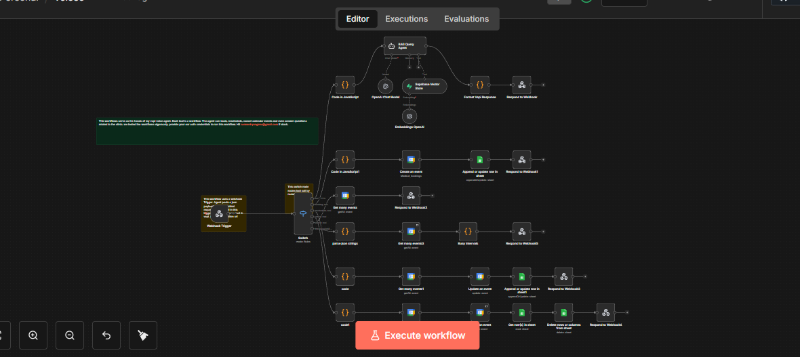
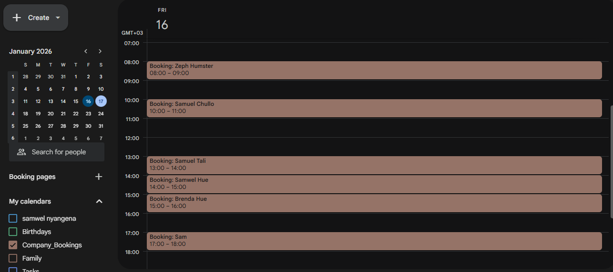
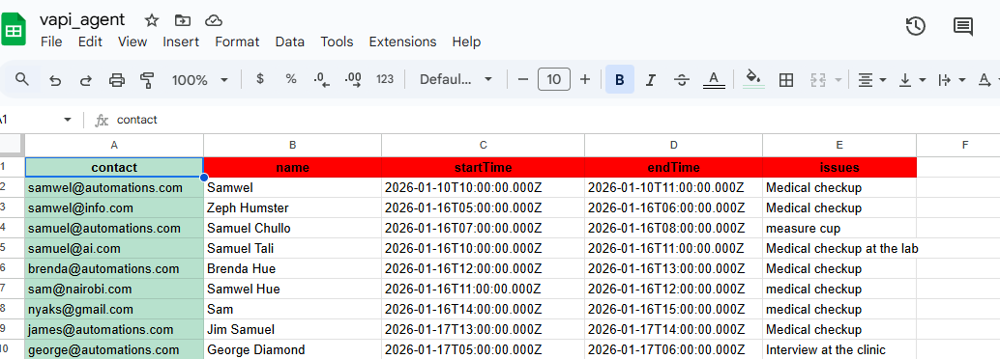

# Jane — Ethic Clinic Voice Agent

Jane is a high-performance, AI-driven voice receptionist built for **Ethic Clinic**.  
She handles appointment booking, rescheduling, cancellations, and clinic inquiries using natural, human-like conversation — fully automated and synchronized in real time.

The agent is powered by **Vapi.ai** for voice orchestration and **n8n** as the execution engine, with tight control over scheduling logic, timezones, and data integrity.

---

## Project Overview

Jane functions as a virtual front desk coordinator capable of:

- Verifying existing appointments
- Booking new consultations
- Rescheduling or cancelling appointments
- Answering clinic-specific questions using Retrieval-Augmented Generation (RAG)

All actions are synced in real time between **Google Calendar** and **Google Sheets**, ensuring a single source of truth.

---

## Demo

The agent is live and reachable via phone.

**Phone Number:** `+1 (661) 543 1366`

### How to Test
1. Call the number and say: “Hi, I’m [your name]”
2. Ask to book, reschedule, or cancel an appointment
3. Ask a clinic question such as:  
   “What services do you offer?”
4. Observe real-time updates in Google Calendar and Google Sheets

---

## System Architecture

Jane follows a modular, production-grade architecture:

- **Vapi.ai** — Voice, telephony, and conversation streaming
- **n8n** — Central orchestration, logic enforcement, and tool execution
- **Google Calendar** — Appointment scheduling
- **Google Sheets** — CRM and audit log
- **Vector Database** — Clinic knowledge retrieval

### Architecture Screenshots

| n8n Workflow | Google Calendar | Google Sheets |
|-------------|----------------|---------------|
|  |  |  |

---

## Key Features

### Intelligent Scheduling
- Automatically checks availability before offering any slot
- Enforces Nairobi working hours (08:00–17:00 EAT)
- Prevents double bookings and conflicts

### Real-Time Synchronization
- Every appointment is:
  - Created or updated in Google Calendar
  - Logged instantly in Google Sheets

### Precise Timezone Handling
- All user input assumed to be **Africa/Nairobi (UTC+3)**
- Internally converted using strict ISO 8601 rules
- Eliminates UTC offset errors and scheduling drift

### Context-Aware Conversations
- Searches existing bookings immediately upon email or name mention
- Personalizes responses based on retrieved data
- Asks only one question at a time to avoid confusion

### RAG-Powered Knowledge Base
- Answers clinic-specific questions using vector search
- No hallucinations or generic responses

---

## Tools & Capabilities

Jane operates through structured tools exposed to the LLM:

### RAG_TOOL
Queries the clinic knowledge base to answer service, policy, or operational questions.

### search_tool
Searches Google Calendar for existing appointments using email.

### booking_tool
Creates a new appointment and captures:
- Client name
- Email
- Appointment time
- Reason for visit

### reschedule_tool
Updates an existing appointment after:
1. Identifying the booking
2. Checking availability
3. Confirming the new time

### cancel_tool
Cancels an appointment and removes the corresponding CRM entry.

### checkavailability_tool
Scans the calendar for busy intervals and returns available 1-hour slots.

---

## Conversation Logic (System Prompt)

Jane is governed by a strict system prompt to ensure safety, correctness, and professionalism.

### Identity
- Calm, professional receptionist for Ethic Clinic
- Never reveals internal logic or timestamps

### Time Protocol
- Uses the current Nairobi date from system context
- Converts natural language dates into ISO 8601 timestamps internally
- Never speaks raw timestamps to users

### Mandatory Rules
- Assumes all times are Africa/Nairobi (UTC+3)
- Always checks availability before mentioning booking options
- Never uses past dates
- Never uses the year 2024
- Never asks multiple questions at once

### Conversation Flow
1. Greeting and intent detection
2. Email collection and verification
3. Date and time inference
4. Availability check
5. Slot confirmation or negotiation
6. Full name and reason for visit
7. Final verbal confirmation
8. Tool execution and confirmation

---

## Tech Stack

- **Voice Orchestration:** Vapi.ai
- **Automation Engine:** n8n
- **LLM:** OpenAI GPT-4o-mini
- **Vector Database:** Supabase
- **Embeddings:** OpenAI Embeddings
- **Integrations:** Google Calendar API, Google Sheets API

---

## Installation & Setup

### n8n Setup
1. Import the provided workflow JSON into your n8n instance
2. Configure credentials for:
   - Google Calendar
   - Google Sheets
   - Supabase
   - OpenAI
3. Copy the n8n webhook URL

### Vapi Setup
1. Create a new Assistant in Vapi
2. Paste the system prompt into the assistant configuration
3. Define tools matching the n8n Switch node keys
4. Set the webhook URL to the n8n endpoint

---

## Error Handling

Jane gracefully handles failures:

- Tool failure:  
  “I’m having a technical issue with our scheduling system. Would you like me to try again or have a manager call you back?”

- Past date provided:  
  Politely informs the caller and requests a future date

---

## License

MIT License
